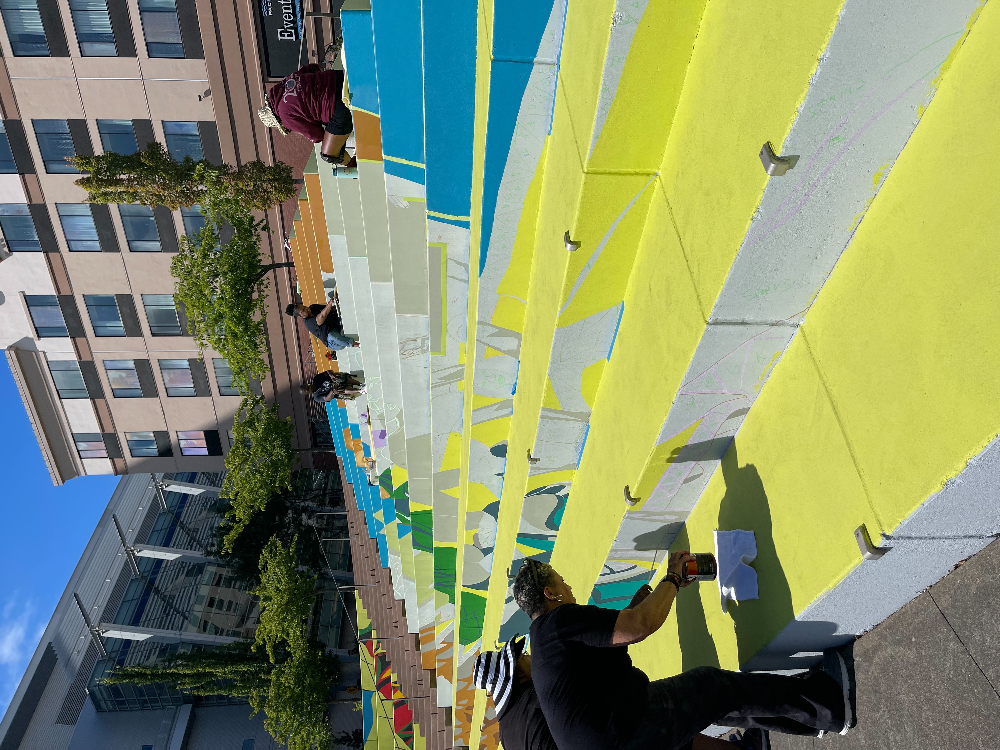
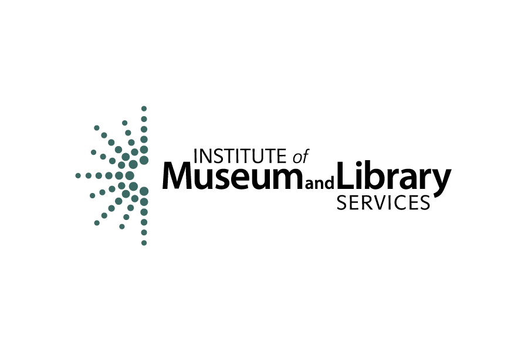
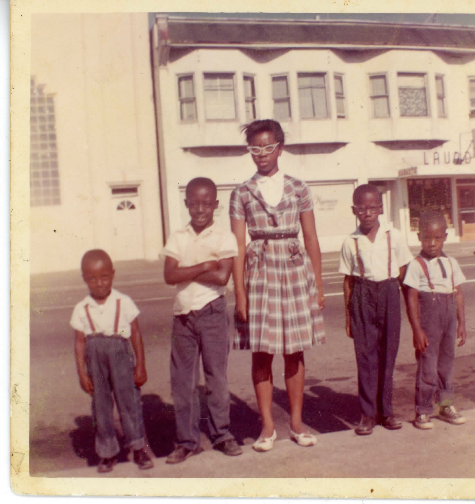

# 🙌 Acknowledgements

<figure><figcaption>
Community members help paint a new Black Lives Matter mural in downtown Tacoma. (Black Lives Matter Mural Project Collection, CAC3002, Community Archives Center at Tacoma Public Library).
</figcaption></figure>

Thank you to all of the Tacoma community members who shared their stories with the Community Archives Center. We also want to acknowledge the contributions of our many community partners including:

* Asia Pacific Cultural Center
* Association of Colored Women's Clubs Tacoma
* City of Tacoma Office of Arts and Cultural Vitality
* City of Tacoma Office of Historic Preservation Evergreen State College Tacoma
* Goodwill Industries
* Grit City Magazine
* Hilltop Action Coalition
* Hilltop Artists
* Korean Women's Association
* KTQA Tacoma
* Metro Parks
* Pacific Lutheran University
* Radio Tacoma
* Rainbow Center
* Salishan Association
* Tacoma Action Collective
* Tacoma Arts Live
* Tacoma Community College
* Tacoma Community House
* Tacoma Historical Society
* Tacoma Housing Authority
* Tacoma Public Schools
* Tacoma-Pierce County Black Collective University of Puget Sound
* WILLO

### Special thanks to&#x20;

<figure><figcaption></figcaption></figure>

Contact Info

Tacoma Public Library\
1102 Tacoma Ave S\
Tacoma, WA 98402\
(253) 280-2819\
[www.tacomalibrary.org/communityarchives](https://www.tacomalibrary.org/communityarchives) \
communityarchives@tacomalibrary.org

<figure><figcaption>
Photograph of young people at 1007 Martin Luther King Jr Way, Tacoma in July 1961 from Keith D. Wells. (Hilltop Story Fest Collection, CAC0003, Community Archives Center at Tacoma Public Library).
</figcaption></figure>
