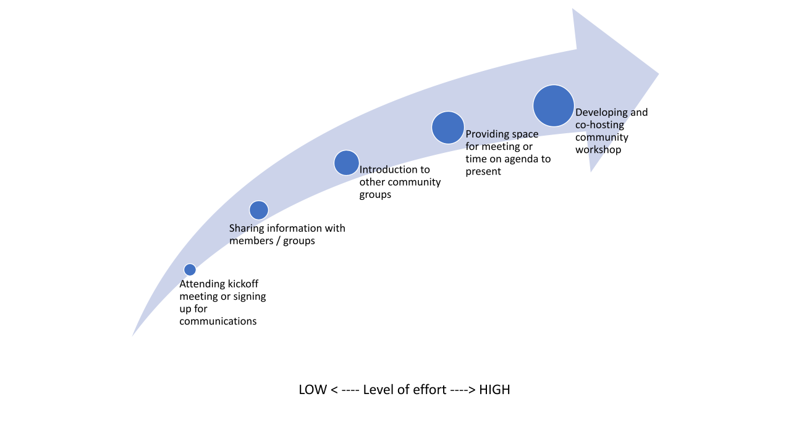
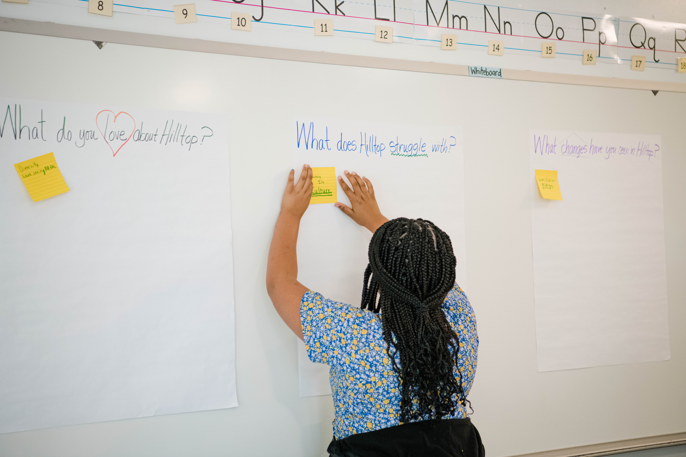

# Appendix A. Planning & Launch Resources

### Partnership Engagement Priority List

<figure><figcaption>
Figure 21: The graphic illustrates the level of effort needed for different types of engagement. Activities on the lower left end of the arrow require less effort, while activities on the upper right end of the arrow require more effort.
</figcaption></figure>

<figure><figcaption>
Table 1: These are different types of activities that we prioritized to engage with community partners. Low engagement signifies the lower return of expected outreach from that activity, while High engagements signifies the higher return of expected outreach.
</figcaption></figure>

### Board of Trustees and Staff Presentation

* [TCAC Board Presentation](https://drive.google.com/file/d/1oK6kE42GktlTg7EM8rWstbfciQbdDHoy/view?usp=share\_link)&#x20;

### Job Descriptions&#x20;

* [Project Intern posting](https://drive.google.com/file/d/14K0sQ2IK\_22pE8\_9EFsRVnJORQHCcQ7o/view?usp=drive\_link)
* [Project Library Associate posting](https://drive.google.com/file/d/1eUoYA93kgY4GAcDMtmwV2qmS4vKSoWUM/view?usp=drive\_link)

### Grant Development, Sustainability, Funding Resources

* [Preliminary and Final Grant Proposals for IMLS Grant](https://imls.gov/grants/awarded/lg-250126-ols-21) (LG-250126-OLS-21)—The Tacoma Public Library will bring community members and organizations together to carry out a fully participatory process to broaden participation and inclusion within cultural heritage collections. This will create a model for institutions in small- and mid-sized urban areas seeking to enter collaborative partnerships with diverse groups to produce more equitable archives. This work contributes to greater understanding of how to develop better models of community partnerships for supporting community archives and how to expand knowledge of the impact of archives on urban communities.
* [Library Grants blog](http://librarygrants.blogspot.com/) is an updated list of grant opportunities compiled by Stephanie Gerding who focuses on grant writing

<figure><figcaption>
Figure 22. An attendee at Hilltop Story Fest responds to the question "What does Hilltop struggle with?", May 6, 2023. Photo by Mikayla Heineck.
</figcaption></figure>
