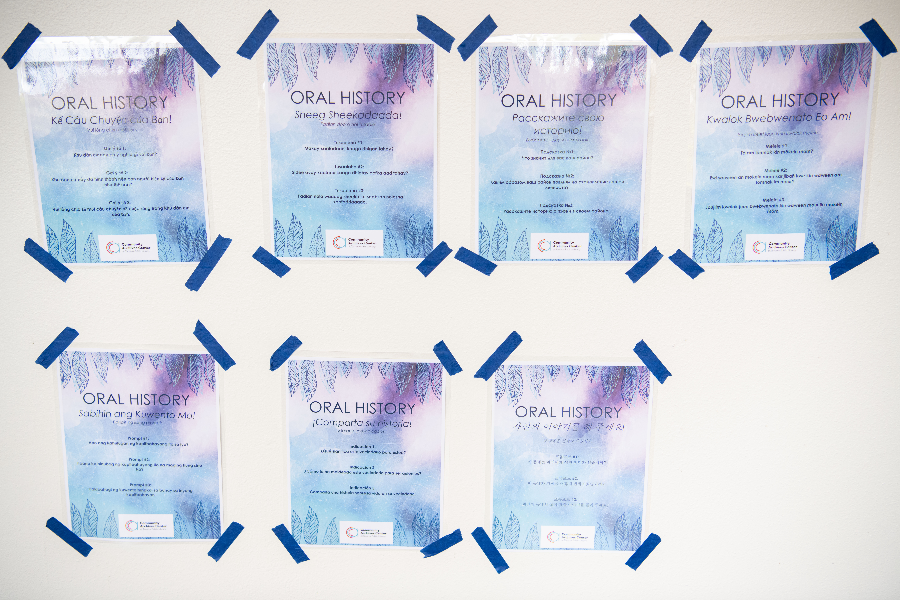

# Appendix F. Technical Resources

### Database platforms

* [Mukurtu CMS](https://mukurtu.org/)
* [The Collections Management System Collection](https://docs.google.com/spreadsheets/d/1cXOug3qM0pNNeD\_wssiVEv9c0W1Y5I1VDTnSPTk7fb4/edit)—A crowd-sourced list of digital  repository options to reference for the diversity of options for collection management systems (aka digital repositories, content management system, or CMS).

### Story Map platforms

* [Tacoma Stories](https://uw.maps.arcgis.com/apps/CrowdsourceReporter/index.html?appid=f5c9f63d17274acca30a816f2946768e)—the map platform created as part of the CAC project.
* [Create a Community My Map](https://applieddigitalskills.withgoogle.com/c/middle-and-high-school/en/create-a-community-my-map/overview.html)—customize a map that highlights locations important to your community and culture requires a Google for Education account.
* [Felt](https://felt.com/for-everyone)—freemium collaborative mapping platform.
* [HistoryPin](https://about.historypin.org/how-to-guides/)—free multimedia mapping and storytelling tool.

<figure><figcaption>
Figure 23. Oral history prompts in 9 languages at Salishan Story Fest, August 13, 2022. Photo by Mikayla Heineck.
</figcaption></figure>
