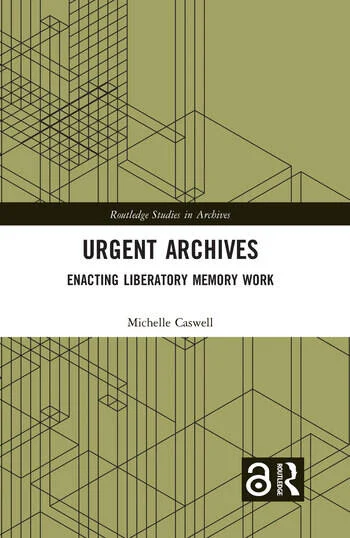
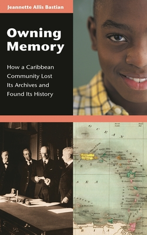
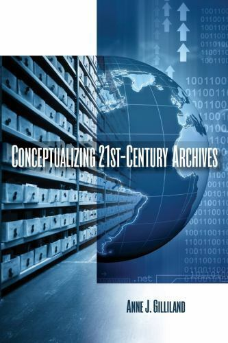
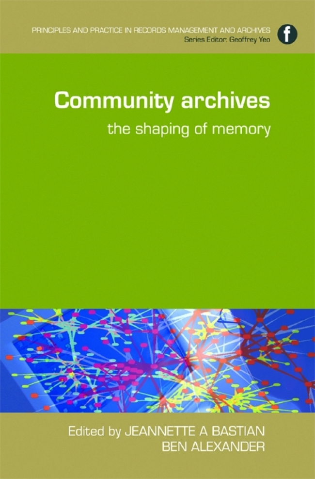
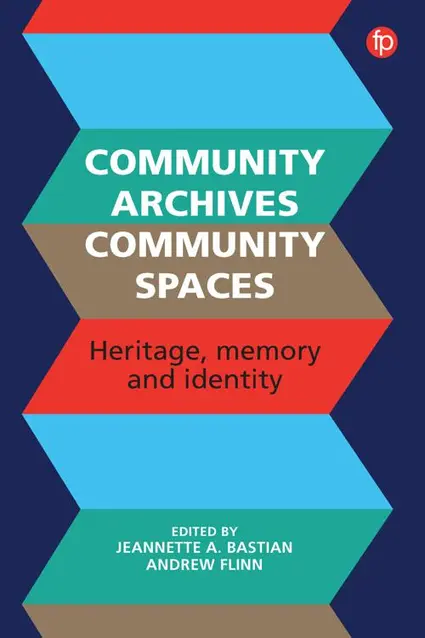

# 1.1 Background on Community Archives

<figure><figcaption></figcaption></figure>

 

<figure><figcaption></figcaption></figure>

 

<figure><figcaption></figcaption></figure>

 

<figure><figcaption></figcaption></figure>

 

<figure><figcaption></figcaption></figure>

For at least five decades, archival scholars and archivists have illuminated a significant problem with the American historical record: routinely missing from it are the experiences of marginalized and underrepresented communities ([Zinn, 1977](https://www.jstor.org/stable/41101382)). Their histories have not just been excluded from the historical record—they have been actively suppressed, elided, and/or misrepresented—a phenomenon called “symbolic annihilation,” which occurs when marginalized groups are systematically misrepresented or excluded from archives ([Caswell, Cifor, and Ramirez, 2016](https://americanarchivist.org/doi/full/10.17723/0360-9081.79.1.56)). In response to this and other concerns about the ways in which archives are imbricated in power and can amplify oppression, since the 1990s there have been increasing calls to reformulate archival scholarship and practice around core values of social justice ([Gilliland and Flinn, 2013](https://www.monash.edu/\_\_data/assets/pdf\_file/0007/920626/gilliland\_flinn\_keynote.pdf)). Professionals and scholars working in “critical archival studies” ([Caswell, Sangwand, and Punzalan, 2017](https://core.ac.uk/display/234708076)) paradigm have been leading efforts to make archives more inclusive; to expand and rethink archival concepts and training; and to develop community archives as means to work toward transforming archival practice and society more broadly.

Archival scholars Andrew Flinn, Mary Stevens and Elizabeth Shepherd ([2009](http://link.springer.com/10.1007/s10502-009-9105-2)) define community as&#x20;

> "any manner of people who come together and present themselves as such”.

Following this, they posit that a “community archives” occurs when individuals come together to “document the history of their commonality” ([Flinn et al., 2009, 75](http://link.springer.com/10.1007/s10502-009-9105-2) in [Caswell et al., 2016, 61](https://americanarchivist.org/doi/full/10.17723/0360-9081.79.1.56)). Community archiving is an important approach for producing and making accessible a more inclusive and richly diverse heritage. Within the United States and across the globe, community archives and related heritage initiatives come in many different forms (large or small, semi-professional or entirely voluntary, with formal or collective governance models, long-established or very recent, conducted in partnership with heritage organizations and/or professionals or entirely independent).&#x20;

Community archives may form around commonalities such as&#x20;

* geography
* identity
* occupation
* interest
* faith
* belief
* experience
* purpose
* event
* mission

If there is a singular defining characteristic of diverse community archives, it is the active participation of the community in documenting, collecting, managing, and making accessible the history of their particular community “on their own terms” ([Flinn et al., 2009](http://link.springer.com/10.1007/s10502-009-9105-2)).&#x20;

Anne J. Gilliland's ([2013](https://www.monash.edu/\_\_data/assets/pdf\_file/0007/920626/gilliland\_flinn\_keynote.pdf)) "Voice, Identity, Activism (VIA) Framework for Approaching Archives and Recordkeeping" further describes the shared characteristics among archival initiatives that evolve from grassroots, identity-based, and social justice orientations.&#x20;

<figure><figcaption>
Figure 1. Reverend Bob Penton engages with the speaker at Salishan Story Fest, August 13, 2022. Photo by Mikayla Heineck.
</figcaption></figure>

Often highly participatory, community archiving considers the role that social identity and power play in shaping our understanding of history and presents accessible tools for enriching historical narratives with absent and underrepresented voices. Community archives are characterized by key principles of&#x20;

* broadening participation in archival production
* sharing stewardship of archives with community members and organizations
* developing alternative archival practices sensitive to community needs
* accounting for pluralistic perspectives
* representing and advocating for more socially just societies

Community archives are more likely to collect a vast array of materials—for example, objects, books, and archival records—and to pay little heed to traditional distinctions among museums, libraries, and archives. These organizations are often attuned to the role of archives not only in research, but in education, community building, and for developing coalitions.&#x20;

Although local historical and antiquarian societies, churches, and regional museums have been collecting community records for more than a century, the veritable boom in community archives did not occur until the 1970s and 1980s. Flinn, Stevens, and Shepherd ([2009](http://link.springer.com/10.1007/s10502-009-9105-2)) and Gilliland and Flinn ([2013](https://www.monash.edu/\_\_data/assets/pdf\_file/0007/920626/gilliland\_flinn\_keynote.pdf)) suggest that interest in collecting community records was, in significant part, a response to the protest cycles that began in the 1960s, which included antiwar, feminist, civil rights, labor, gay and lesbian liberation, and student activism emerging as expressions of larger postwar anti-establishment movements.&#x20;

The rise of oral history and public history methodologies born of a desire to create “history from below” that would  document the experiences of “so-called ordinary working people” ([Perks and Thomson, 2016](https://www.worldcat.org/title/920469609)) and the dearth of academic work for trained historians ([English, 1983](https://doi.org/10.2307/3376945)) in the 1960s and 1970s also contributed to the growth of the community archives movement.&#x20;

Perks and Thomson credit in particular Alex Haley's best-selling, Roots: The Saga of an American Family, with popularizing oral history within and outside of Black communities in the United States, as it encouraged communities not only to record their own “roots” but moreover to invest in local and community documentary heritage as a vital aspect of community building.&#x20;

What Rebecka Sheffield calls “the sec­ond wave of community archives” emerged in the late 1990s in response to the rise of anti-capitalist, postindustrial social movements that leveraged par­ticipatory and do-it-yourself (DIY) cultural production approaches.&#x20;

Community archives have often emerged from other forms of cultural production, such as community publications, and rely heavily on support from the publisher or a community service organization. The ArQives, for example, grew out of the working files of The Body Politic and was financially supported by the publishing collective for nearly two decades (Sheffield, 2015).&#x20;

Similarly, the Lesbian Herstory Archives was first a personal collection housed in its founder's apartment before growing into a larger collective with a space of its own  (Sheffield, 2015). Flinn and Stevens (2009) and Sheffield (2014) position community archives as part of larger movements in which groups whose histories and lives have been symbolically annihilated by mainstream institutions initiate archival projects as means of self-representation, identity construction and empowerment. Diana K. Wakimoto, Christine Bruce, and Helen Partridge's ([2013](https://doi.org/10.1007/s10502-013-9201-1)) study of three LGBTQ commu­nity archives in California provides further insight into the relationships of community activism and the development of community archives.

More recently, there has been a new wave of investment in community documentation that leverages digital technologies to collect records and make them available to communities in a manner that transcends geographic and temporal boundaries. Caswell ([2014](https://doi.org/10.1080/01576895.2014.880931)) describes how the South Asian American Digital Archives (SAADA) founded in 2008 grew out of a desire to preserve archival materials related to South Asian American experiences. The post-custodial digital repository now holds more than 1,500 records, docu­menting Stories as diverse as Punjabi labor resistance in the 1910s to Muslim punk bands in the 2010s. SAADA has developed a network of scholars and community members invested in supporting the archives both financially and intellectually.&#x20;

The Digital Transgender Archives (DTA), which launched in 2015, serves as both a repository and union catalog by harvest­ing metadata from various partner organizations to build a database of records created by, for, and about transgender people worldwide (DTA, 2015). Similarly, the Archives of Lesbian Oral Testimony (ALOT) works with community documentarians to collect oral history records documenting lesbian life  and makes these accessible through digitization (Chenier [2009](https://archivaria.ca/index.php/archivaria/article/view/13239); [2015](https://doi.org/10.1215/01636545-2849576); [2016](https://doi.org/10.1093/ohr/ohw025)). As Elise Chenier (2009) explains of ALOT, the use of digital technolo­gies can bring together dispersed collections that were previously rendered inaccessible because they were either recorded in now defunct media formats or housed among personal collections.&#x20;

Bringing together dispersed records online, what Ricardo L Punzalan ([2014](https://doi.org/10.1086/676489)) calls "virtual reunification,'' can not only present a more holistic understanding of community history but also strengthen ties among community members. Digital community archives have become increasingly prevalent, but present new complexities as they require significant infrastructural investment to ensure that platforms are developed and supported over time.

<figure><figcaption>
Figure 2. A photo of the Tacoma High School Class of 1900 was digitized at a community event. (Community Event Collection, CAC0003, Community Archives Center at Tacoma Public Library).
</figcaption></figure>

Some community archives may resist bureaucratization as a political principle, preferring to remain informal grassroots efforts. Established community archives may decide to integrate collections into a more formal repository (e.g., a public library or a university archives). Other community archives efforts emerge from or develop within larger institutions and their community partners, as is the case of the Community Archives Center for Tacoma.&#x20;

Archivists and librarians give their professional skills, whether as employees, partners, or volunteers, advocates, or activists of all such organizations. Wherever they are situated, community archives frequently foreground issues of community control and autonomy even if they welcome partnerships or emerge with support from more formal heritage bodies or trained professionals.&#x20;

Working with and within large information institutions is an important way for communities to raise public profile and strengthen ties, and can crucially build capacity for access, fundraising, development, and community engagement activities. As Caswell (2014) notes, however, many community archives work carefully to maintain the balance between relying on well-established institu­tions to provide stability and resources  and the desire to remain community-driven.\
