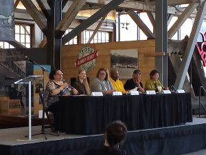

# 3.3 Community Outreach

The project also implemented a wide range of community-centered collection building processes. We sought to increase awareness about the project and provide opportunities for community members to contribute to our collection. This involved a combination of community outreach at  existing community events, engaging in 1:1 material collection and interviews, and holding our own community events.&#x20;

The project team hosted informational tables at several community events. They shared information about the community archive project, connected with potential partners, and provided attendees with the opportunity to indicate interest in the project.&#x20;

Our project staff were invited to some of these events by the organizers in some instances, and attended as part of a larger library presence in other instances. TPL’s Outreach Librarian, who coordinates library-wide tabling activities, kept project staff posted on events that were of potential interest.&#x20;

Events were selected for participation based on staff availability and connections to the goals of the project. We tabled at the following events for our project:&#x20;

* Black History Month Celebration at the Peoples Community Center
* Project Homeless Connect at St. Leo Parish
* Sustainability Expo at the University of Washington-Tacoma
* Salishan Outdoor Movie Night at the Salishan Family Investment Center
* Salishan National Night Out at the Salishan Family Investment Center
* East Side Farmers Market
* Hilltop Street Fair

This list hopefully sparks some ideas for your own efforts!

<figure><figcaption>
Figure 11. A panel of community members who participated in the Community Archives Center project discuss the importance of documenting local stories at a workshop for local K-12 teachers, February 2023.
</figcaption></figure>

In addition to tabling at existing events, our project also delivered presentations to several local organizations. See [Appendix A](../appendix-further-reading-and-resources/appendix-a.-planning-and-launch-resources.md#board-of-trustees-and-staff-presentation). These presentations were either held at special meetings or project staff were invited to attend scheduled group meetings as guest speakers.&#x20;

Project staff introduced&#x20;

* the goals of the Community Archives Center
* demonstrated the Northwest ORCA database
* described options for organizations to partner on the project

Time was provided for Q\&A and brainstorming with the organization about their ideas for possible collaborations. Presentations were delivered to the&#x20;

* Tacoma-Pierce County Black Collective
* People’s Assembly
* Black Women’s Caucus of Washington State
* Hilltop Library Planning Committee
* Tacoma Sunrise Rotary Club
* Radio Tacoma

Presentations were delivered to groups who expressed interest in the project but requested additional information be provided to their members.

<figure><figcaption>
Figure 12. The first page of a 1978 Fact Sheet digitized in February 2023 for the Black Women's Caucus of Washington State, Tacoma Chapter Records collection. (Community Event Collection, CAC2008, Community Archives Center at Tacoma Public Library).
</figcaption></figure>
