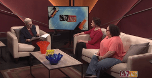

# 4.2 Raising Public Awareness

The project team developed strategies for raising public awareness about the new availability of the collection including:

### Community Presentations

Opportunities to share the collection with the community and solicit new participants

* “Many Voices, Many Stories” presentation on the Community Archives Center for Preservation Month, hosted by the City of Tacoma Historic Preservation Office, May 6, 2022
* “Uncovering Hidden Stories Through Local History Collections,” presentation on the Community Archives Center for the City of Tacoma’s Heritage Cafe Series, November 2022 [https://www.cityoftacoma.org/in\_the\_news/presentsuncoveringhiddenstories](https://www.cityoftacoma.org/in\_the\_news/presentsuncoveringhiddenstories)&#x20;

<figure><figcaption>
Figure 17. Community Archives Center staff appear on local talk show Cityline to discuss the project, February 2023.
</figcaption></figure>

### Raising Awareness within the Library

Important to develop advocates for the project within your own institution

* Presentations for Library staff, Library Board of Trustees (see [Appendix A](../appendix-further-reading-and-resources/appendix-a.-planning-and-launch-resources.md#board-of-trustees-and-staff-presentation))

### Media

Local news media coverage promoting community events and provides context about the broader project:

* March 10, 2023 - \[News report] [Tacoma's Rental Housing Code, Tacoma Report](https://www.youtube.com/watch?v=A66fTZ6H9EU\&list=PLHN0JO4Eyqcc9RtkqmwBT3XcZpYheNCQ7\&index=14\&ab\_channel=CityofTacoma)
* February 23, 2023 - \[TV interview] [Tacoma Public Library Community Archives Center,  Cityline](https://www.youtube.com/watch?v=ZV0wTuq5stY\&feature=youtu.be\&ab\_channel=CityofTacoma)
