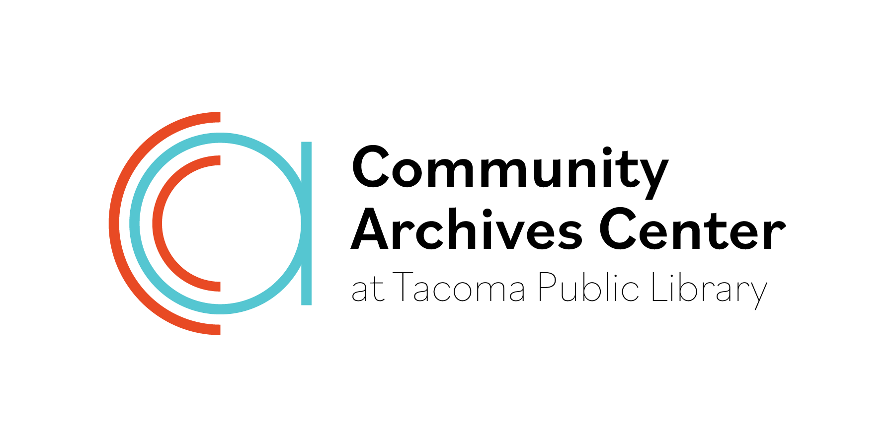

# 💖 Who are we?

Our project team was composed of practicing archival and library staff and a group of academics who have archival, library, and research experience.&#x20;

[Tacoma Public Library (TPL)](https://www.tacomalibrary.org/) had an existing archive, the [Northwest Room](https://www.tacomalibrary.org/northwestroom/), that preserves and provides access to materials related to the history, people, places, and built environment of Tacoma, Washington and the South Sound region.&#x20;

<figure><figcaption></figcaption></figure>

The [Community Archives Center (CAC) at the TPL](https://www.tacomalibrary.org/communityarchives/) leverages existing professional and technical resources to address the gaps and silences existing in the local history record through a community-driven, participatory process.&#x20;

<figure><figcaption></figcaption></figure>

The [University of Washington Technology & Social Change Group (TASCHA)](https://tascha.uw.edu/) center explores the complex relationship between digital technologies and society, with a focus on marginalized groups, and public libraries as centers for individual learning and community development.

hero image credit

The Northwest Room at Tacoma Public Library. CC-SA 2015 by Joe Mabel

